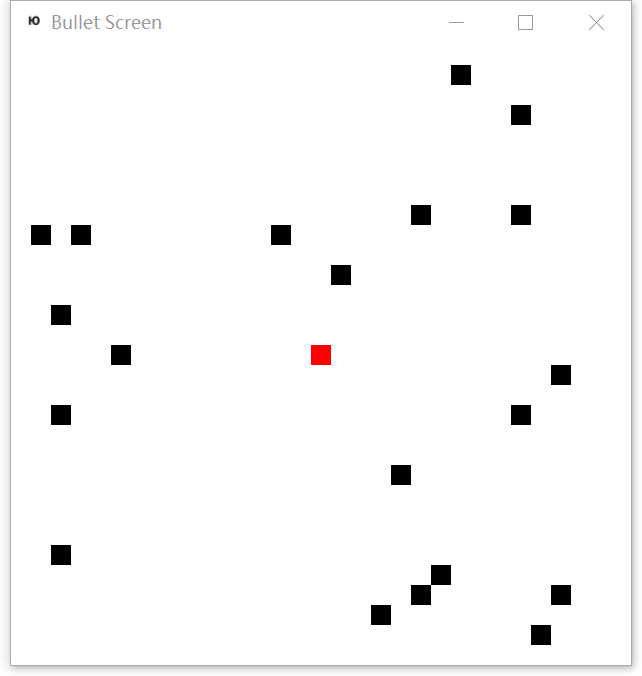

# AlphaBulletScreen
Play Bullet Screen Game with Artificial Intelligence

## Features
+ Complete Bullet Screen Game based on pure Python

+ Deep reinforcement learning [1]:

    Home-made Deep Q network

## How to use 
+ Play BulletScreen Game by yourself

        cd alphabulletscreen
        python alphabulletscreen.py --play --verbose

+ Re-train AI model for BulletScreen Game
        
        cd alphabulletscreen
        python alphabulletscreen.py --retrain --verbose

+ Continue to train AI model for BulletScreen Game
        
        cd alphabulletscreen
        python alphabulletscreen.py --train --verbose

+ Watch the AI model to play BulletScreen Game (Please train AI model first)

        cd alphabulletscreen
        python alphabulletscreen.py --playbyai --verbose

The option "--verbose" is for debugging purpose  
Press key `left`,`right`,`up` and `down` to play the game

## E-mail
longyang_123@yeah.net  
You're most welcome to contact with me to discuss any detail about this project

## Extra
I have written many home-made mini-game projects for mastering the reinforcement learning technologies, which can be found in my GitHub repositories. Maybe there are some hidden bugs behind them, i.e, game mechanism flaws, ill network structure, unreasonable or unappropriate parameters. But I am making progress and try to do my best. Practices make better. -- Yang Long (2018.9.20 GMT+8)

## Reference
[1]Mnih, Volodymyr, et al. "Human-level control through deep reinforcement learning." Nature 518.7540 (2015): 529.